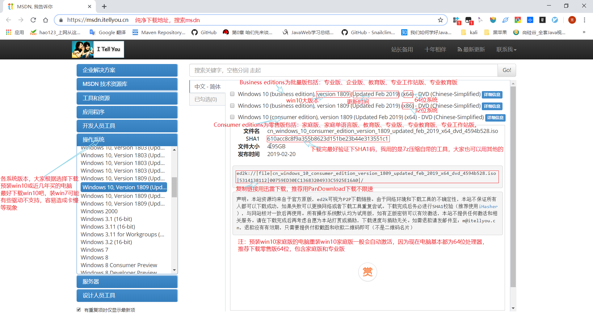
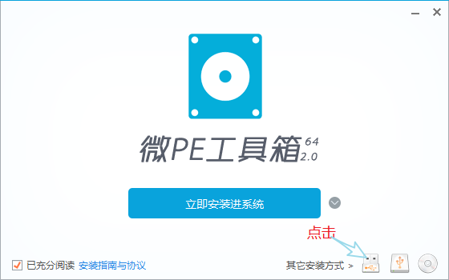
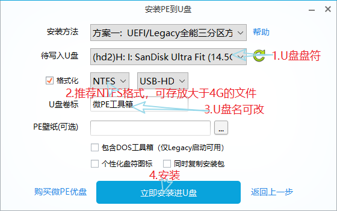
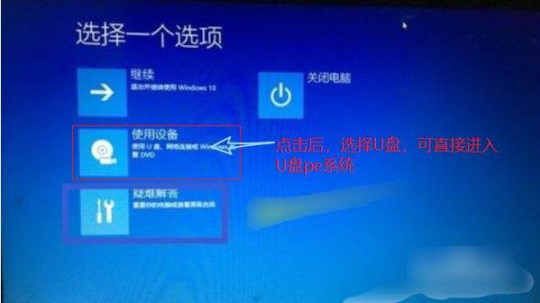

# 重装系统

- [重装系统](#%E9%87%8D%E8%A3%85%E7%B3%BB%E7%BB%9F)
  - [分区](#%E5%88%86%E5%8C%BA)
  - [下载镜像](#%E4%B8%8B%E8%BD%BD%E9%95%9C%E5%83%8F)
  - [重装(多种方式)](#%E9%87%8D%E8%A3%85%E5%A4%9A%E7%A7%8D%E6%96%B9%E5%BC%8F)
  - [激活(如有正版，可忽略)](#%E6%BF%80%E6%B4%BB%E5%A6%82%E6%9C%89%E6%AD%A3%E7%89%88%E5%8F%AF%E5%BF%BD%E7%95%A5)

## 分区

> 首先聊一聊我自己的分区情况  
> window(C:)：SSD 120G  
> Data(D:)：HDD 1T  

约定：

> 1. 系统装在C:盘
> 2. 所有常用软件包括绿色软件装在C:\Program File中，不和系统程序装在一起，自己装了什么软件一清二楚
> 3. 所有开发软件放在C:\dev中，包含IDEA，Tomcat，Java等
> 4. 下载的镜像放在D:\OS中,虚拟镜像放在D:\VM_OS中
> 5. 以上仅为我自己的约定，大家可以参考

## 下载镜像

1. 去[MSDN](https://msdn.itellyou.cn)网站下载  
   
2. 获得文件cn_windows_10_consumer_edition_version_1809_updated_feb_2019_x64_dvd_4594b528.iso，放在D:\OS中待用

> 1. 不推荐在msdn中下载win7，因为要安装网卡和其他驱动，还要安装各种安全补丁等，非常麻烦
> 2. 推荐[吻妻系统](http://www.newxitong.com/list/)，仅推荐下载季度纯净版

## 重装(多种方式)

1. 直接安装(最简单)
   1. 下载安装[7-Zip](https://www.7-zip.org/)，也可用其他解压软件
   2. 直接双击或解压镜像，运行里面的setup.exe，按提示安装
2. [硬盘下安装Ghost系统简易教程](https://mp.weixin.qq.com/s/qhNlMjLzwYWXE97JxcpymQ)
3. 使用U盘安装
   1. 下载[微PE工具箱](http://www.wepe.com.cn/download.html)
   2. 插入U盘，打开安装WePE_64_V2.0.exe  
     
     
     
   3. 设置U盘启动(自己百度)，[win10进入BIOS](https://jingyan.baidu.com/article/8275fc864d423e46a03cf638.html)  
   
   4. 进入win10pe系统，进行重装系统

> 注意：能进入系统使用U盘安装iso镜像可以直接放在非系统盘(如：D盘)中，不能进入系统iso镜像要复制到U盘中

## 激活(如有正版，可忽略)

1. 下载激活软件[MicroKMS](http://www.yishimei.cn/network/319.html)
2. 傻瓜式一键操作