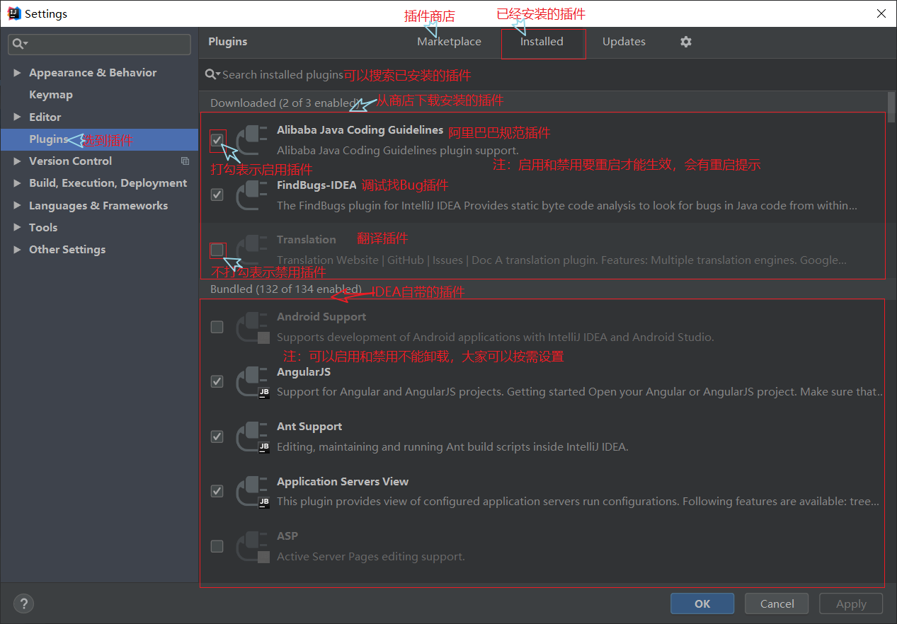
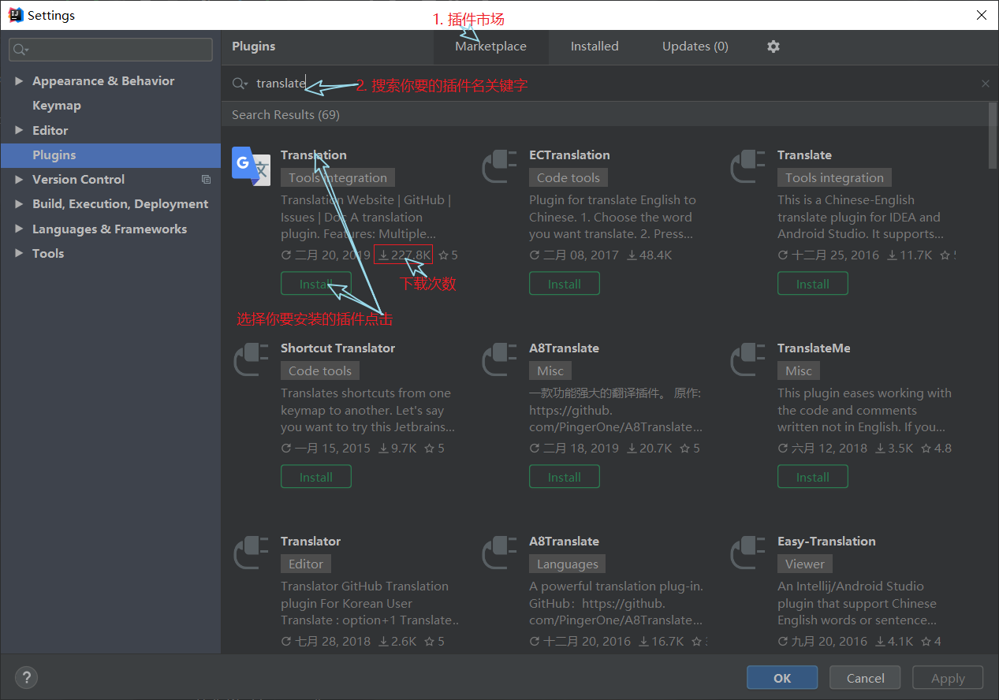
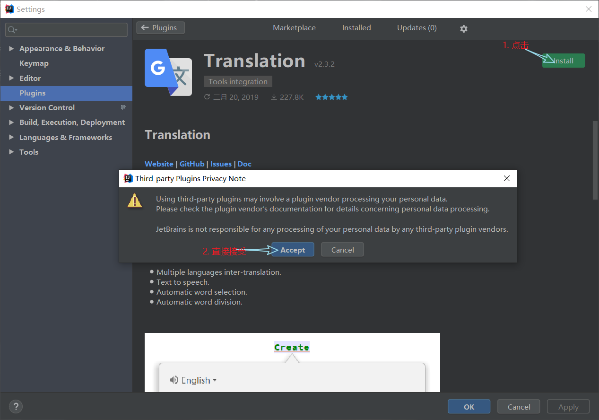
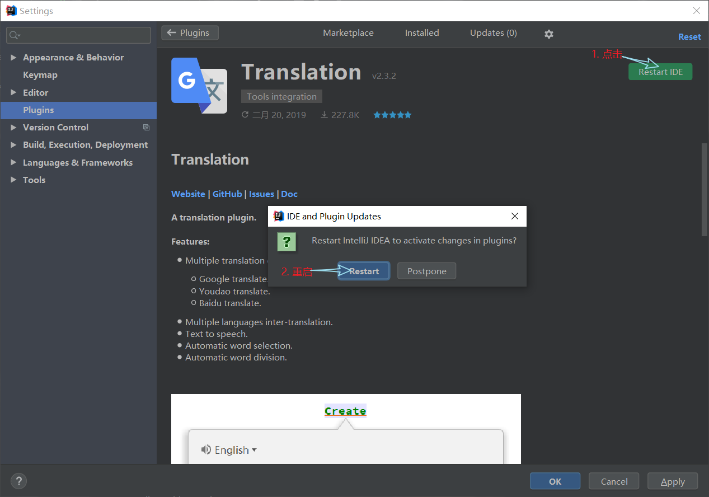
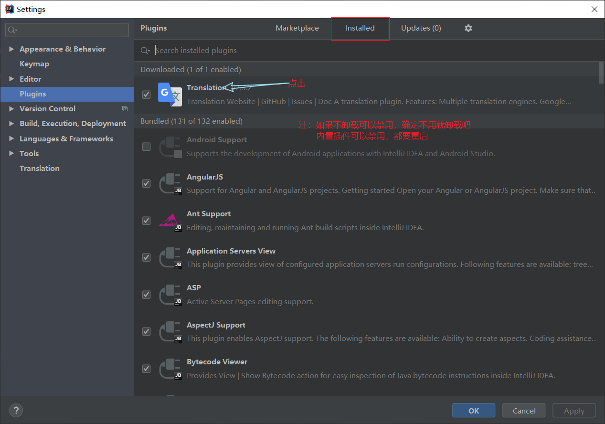
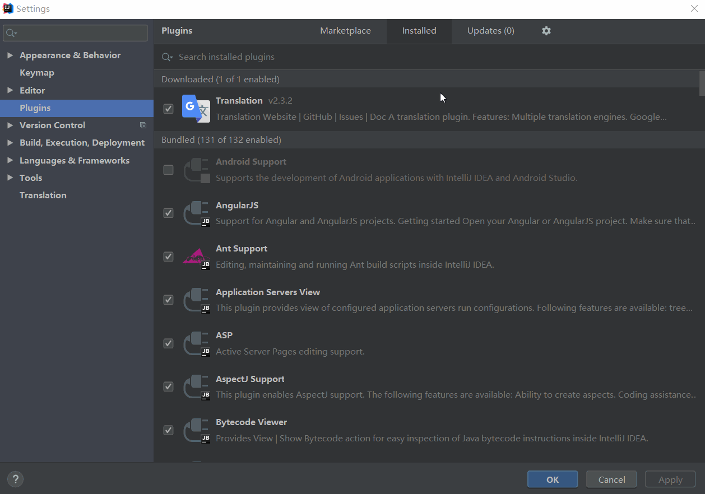

# idea插件安装和推荐

## idea插件安装和卸载

1. 打开设置(快捷键：Ctrl+Alt+S)  
   
2. 查看插件  
   
3. 安装插件  
     
     
     
4. 卸载插件  
     
   

## idea插件推荐

1. Translate(翻译插件，内置强大的谷歌翻译)
2. Alibaba Java Coding Guidelines(阿里巴巴Java开发规约)