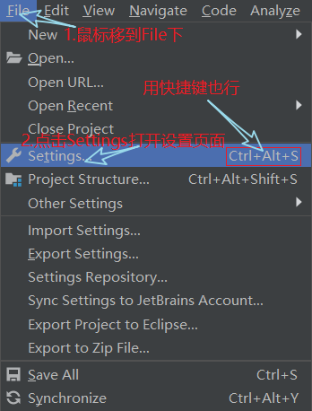

# idea的安装，破解，优化

- [idea的安装，破解，优化](#idea%E7%9A%84%E5%AE%89%E8%A3%85%E7%A0%B4%E8%A7%A3%E4%BC%98%E5%8C%96)
  - [idea的安装](#idea%E7%9A%84%E5%AE%89%E8%A3%85)
    - [下载idea](#%E4%B8%8B%E8%BD%BDidea)
    - [安装idea](#%E5%AE%89%E8%A3%85idea)
  - [idea的破解](#idea%E7%9A%84%E7%A0%B4%E8%A7%A3)
    - [下载破解补丁](#%E4%B8%8B%E8%BD%BD%E7%A0%B4%E8%A7%A3%E8%A1%A5%E4%B8%81)
    - [破解](#%E7%A0%B4%E8%A7%A3)
  - [idea的优化](#idea%E7%9A%84%E4%BC%98%E5%8C%96)
    - [还原默认配置](#%E8%BF%98%E5%8E%9F%E9%BB%98%E8%AE%A4%E9%85%8D%E7%BD%AE)
    - [详解idea的安装目录](#%E8%AF%A6%E8%A7%A3idea%E7%9A%84%E5%AE%89%E8%A3%85%E7%9B%AE%E5%BD%95)
    - [一些基本设置优化](#%E4%B8%80%E4%BA%9B%E5%9F%BA%E6%9C%AC%E8%AE%BE%E7%BD%AE%E4%BC%98%E5%8C%96)

## idea的安装

### 下载idea

1. 百度搜索idea
2. 转到[idea下载页面](https://www.jetbrains.com/idea/download)下载[ideaIU-2018.3.5.exe](https://download.jetbrains.com/idea/ideaIU-2018.3.5.exe)

### 安装idea

1. 双击打开ideaIU-2018.3.5.exe  
   
2. 修改安装路径，个人安装在固态上，启动较快，安装在c:\dev中，个人习惯  
   
3. 创建64位桌面快捷方式  
   
4. 直接安装  
   
5. 安装完成  
   

## idea的破解

### 下载破解补丁

1. 百度搜索**idea注册码码**或**idea破解补丁**
2. 找到[IntelliJ IDEA 注册码](http://idea.lanyus.com)官网
3. 下载破解补丁[JetbrainsIdesCrack-4.2-release-sha1-3323d5d0b82e716609808090d3dc7cb3198b8c4b.jar](http://idea.lanyus.com/jar/JetbrainsIdesCrack-4.2-release-sha1-3323d5d0b82e716609808090d3dc7cb3198b8c4b.jar)

### 破解

1. 查看官方[帮助文档](http://idea.lanyus.com/help/help.html)
2. 建议将破解补丁改名为JetbrainsIdesCrack-4.2-release.jar并放到C:\dev\JetBrains目录下，以便破解JetBrains的全家桶
3. 在 IntelliJ IDEA 安装目录中找到 idea.exe.vmoptions 和 idea64.exe.vmoptions ，以文本格式打开并同时在两个文件最后追加

   ```复制
   -javaagent:C:/dev/JetBrains/JetbrainsIdesCrack-4.2-release.jar
   ```

4. 启动 IntelliJ IDEA
    1. 因为是新装的所以没有配置文件，直接默认ok  
        
    2. 选主题  
        
    3. 选插件  
        
    4. 选主题  
        
5. 输入如下激活码激活(激活码中内容可修改)

    ```JSON
    ThisCrackLicenseId-{
    "licenseId":"ThisCrackLicenseId",
    "licenseeName":"Rover12421",
    "assigneeName":"",
    "assigneeEmail":"rover12421@163.com",
    "licenseRestriction":"For Rover12421 Crack, Only Test! Please support genuine!!!",
    "checkConcurrentUse":false,
    "products":[
    {"code":"II","paidUpTo":"2099-12-31"},
    {"code":"DM","paidUpTo":"2099-12-31"},
    {"code":"AC","paidUpTo":"2099-12-31"},
    {"code":"RS0","paidUpTo":"2099-12-31"},
    {"code":"WS","paidUpTo":"2099-12-31"},
    {"code":"DPN","paidUpTo":"2099-12-31"},
    {"code":"RC","paidUpTo":"2099-12-31"},
    {"code":"PS","paidUpTo":"2099-12-31"},
    {"code":"DC","paidUpTo":"2099-12-31"},
    {"code":"RM","paidUpTo":"2099-12-31"},
    {"code":"CL","paidUpTo":"2099-12-31"},
    {"code":"PC","paidUpTo":"2099-12-31"}
    ],
    "hash":"2911276/0",
    "gracePeriodDays":7,
    "autoProlongated":false}
    ```

    
6. 激活完成  
    

## idea的优化

[官方帮助文档](https://www.jetbrains.com/help/idea/meet-intellij-idea.html)

### 还原默认配置

1. 找到配置文件，一般在C:\Users\lk\\.IntelliJIdea2018.3下  
   
2. 删除重启idea即可，idea非会重新创建新的配置目录

>注：还原默认配置要重新复制激活码激活

### 详解idea的安装目录  


1. bin  
   
2. help  
   
3. 其他的没什么说的

### 一些基本设置优化

1. 打开设置页面  
   
2. 代码提示不区分大小写  
   
3. 开启自动 import 包的功能  
   
4. 自动编译  
   
5. 悬浮提示开关，快速查看类的用途  
   
6. 取消单行显示tabs的操作  
   
7. 设置编码  
   